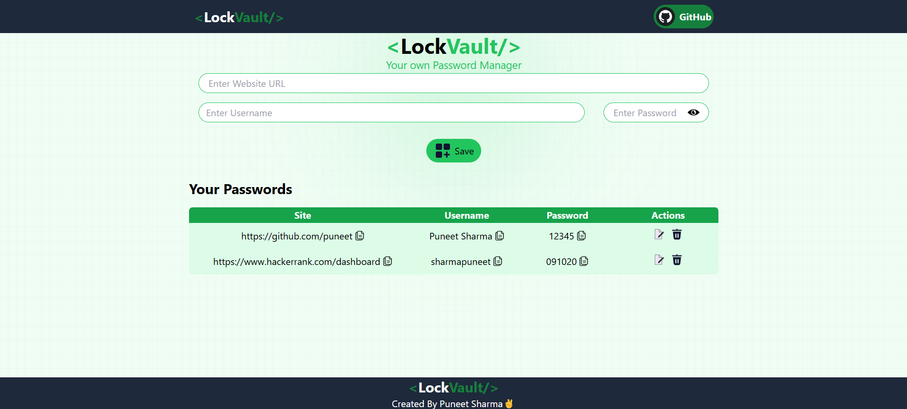

# LockVault - Password Manager

LockVault is a simple password manager built using React. It allows users to store, view, and manage their passwords securely using local storage.

## Features

- Add and store passwords with site URLs and usernames
- View saved passwords with a toggle option
- Edit or delete passwords easily
- Copy credentials to clipboard
- Responsive design for mobile and desktop

## Technologies Used

- React (useState, useEffect, useRef)
- Local Storage for saving passwords
- React Toastify for notifications
- Tailwind CSS for styling

## How to Use

1. Enter the website URL, username, and password.
2. Click the "Save" button to store the password.
3. Use the eye icon to toggle password visibility.
4. Click the copy icon to copy credentials to the clipboard.
5. Edit or delete passwords using the action buttons.

## Installation

1. Clone the repository:
   ```bash
   git clone https://github.com/puneetsharma0910/lockvault.git
   ```
2. Navigate to the project folder:
   ```bash
   cd lockvault
   ```
3. Install dependencies:
   ```bash
   npm install
   ```
4. Start the application:
   ```bash
   npm start
   ```

## Screenshots

### Homepage



## Contributing
Feel free to contribute to the project by submitting issues or pull requests!

## License
This project is open-source and available under the MIT License.
